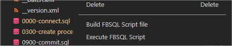

# fbsqlvsc

An extension to implement the FBSQL Command Line Script Player (fbsqlplay.exe).

**Commands:**
- Build FBSQL script - builds a script file from a script folder, which is created or replaced in the script root under the name **script.xss**
- Execute FBSQL script - executes a script folder or file



In VS Code explorer, if a folder or file in an FBSQL script folder is selected, the **Build** and **Execute** commands are offered on the context menu. If a script file (.xss) is selected, only the **Execute** command is available.
Both commands can also be executed by the Command Palette if the above criteria can be applied to the file currently selected in the editor.


## Requirements
- VS Code 1.70.0 or higher
- .Net Framework 4.7.2


## Offline Installation

``` ps
code --install-extension fbsqlvsc-0.3.11.vsix
```

## Extension settings

| Setting ID | description |
| --- | --- |
| FBSQL.beep | Beeps when the script run has finished. |
| FBSQL.configFile | Specifies the folder path containing the config file for the script player. |
| FBSQL.configJpath | Specifies the json path to the section in the config file for the script player. |
| FBSQL.disableAutoClose | Prevents the automatic closing of the terminal session after successful script execution in silent mode. |
| FBSQL.logDelete | Deletes the log file after a successful script run. |
| FBSQL.logDisable | Disables output to a log file. |
| FBSQL.logPath | Specifies the path to output the log file. If only a directory is specified, the file name is concated from the "SQL_" prefix, the machine name, and the current time, e.g. SQL_SERVER01_2022_05_20_23_15_18_588.log. If the value is empty, the automatically named log file is output in the Temp folder of the current user. |
| FBSQL.silentMode | Enables the 'silent mode' script execution mode, no further input is expected. | 


## About the FBSQL Script

An FBSQL script is an XML-formatted text file in which SQL commands are arranged in a tree structure.
This makes it possible to manage complex SQL scripts clearly. For example, individual statements or even complete branches in the script can be excluded from execution by deactivation.
The first version dates back to 2006 and was developed in Object Pascal.


It wasn't until 2012 that a folder-based script format was developed for use in a Git repository. This can be converted into a script file and back into a folder-based script.
From the beginning, FBSQL scripts supported the definition and use of placeholders. Placeholder are strings whose occurrences are replaced in all commands. These are often used to adjust database names and file paths to a central point in the script.
Since 2021, these can now also be assigned in an external JSON formated configuration file. In 2022, the possibility of storing encrypted strings in placeholders was developed.

``` tsql
SET PLACEHOLDER $server$         '.';
SET PLACEHOLDER $instance$       '\MSSQL2016';
SET PLACEHOLDER $dbname$         'DEVDB';
SET PLACEHOLDER $fileStreamPath$ 'C:\Program Files\Microsoft SQL Server\MSSQL13.DEV2016\MSSQL\DATA\';

GO

CONNECT 'Provider=SQLOLEDB.1;Integrated Security=SSPI;Persist Security Info=False;Initial Catalog=master;Data Source=$server$$instance$';

GO

USE master

GO

IF (EXISTS(SELECT *
             FROM sys.databases 
            WHERE name = N'$dbname$'
              AND is_read_committed_snapshot_on = 0))
  ALTER DATABASE $dbname$ SET READ_COMMITTED_SNAPSHOT ON

GO

USE $dbname$

GO
```

### The script file (.xss)

``` xml
<?xml version="1.0" encoding="utf-8"?>
<script version="4.0" sqllanguage="TSQL">
  <version major="1" minor="0" release="1" build="2" />
  <batch name="Test database 1.0.1" executable="true" expanded="true">
    <step name="connect" executable="true">
      CONNECT ...
    </step>
    <batch name="tables" executable="true" expanded="true">
      <step name="create table A" executable="true">
        CREATE TABLE ...
      </step>
      <step name="create table B" executable="true">
        CREATE TABLE ...
      </step>
    </batch>
  </batch>
</script>
```

### The folder script

#### Batch node

A batch node corresponds to a directory. All contained .sql files are interpreted as steps and all directories as child batch nodes.
By default, all files and folders are sorted alphabetically into a batch node. By prefixing a sequence of four digits followed by a hyphen, you can influence the sorting.
The file system arrangement specified in the example ...

  - 0200-b_folder
  - a_folder
  - c_folder
  - 0100-b_file2
  - a_file
  - c_file

... would result in the following arrangement in the script.

  - b_file
  - b_folder
  - a_file
  - a_folder
  - c_file
  - c_folder

If a folder contains a file named **__batch.xml**, it can overwrite the **name** of the node for the script. This can also contain characters that are not allowed in the file system. You can also set the properties **executable** and **expanded**. Both are Boolean values (**true** or **false**). The **expanded property** does not matter to the command line version of the script player.

``` xml
<?xml version="1.0" encoding="utf-8"?>
<batch name="replace \ with /" executable="false" expanded="true" />
```

#### Step node

A step node corresponds to a text file with the extension **.sql**. This can contain one or more commands.

``` tsql
-- <step name="replace \ with /" executable="false" />
```

