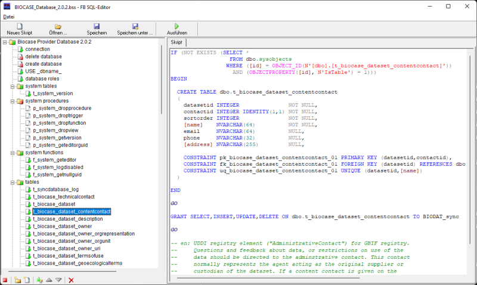

# fbsqlvsc

An extension to implement the FBSQL Command Line Script Player (fbsqlplay.exe).


## About the FBSQL Script

An FBSQL script is an XML-formatted text file in which SQL commands are arranged in a tree structure.
This makes it possible to manage complex SQL scripts clearly. For example, individual statements or even complete branches in the script can be excluded from execution by deactivation.
The first version dates back to 2006 and was developed in Pascal.
<!--  -->
It wasn't until years later that a folder-based script format was developed for use in a Git repository.
This can be converted into a script file and back into a folder-based script.


## Installation

``` ps
code --install-extension fbsqlvsc-0.2.8.vsix
```
